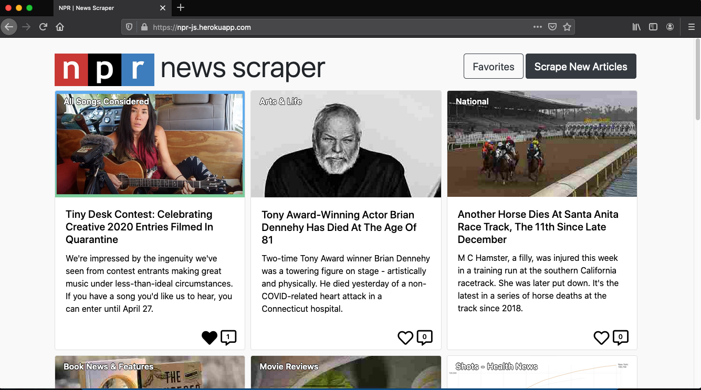

# NPR News Scraper

Full stack web application which scrapes the NPR home page for it's top stories. Data is stored in a MongoDB database by utilizing Mongoose. User can save favorite articles and make notes

deployed at: https://npr-js.herokuapp.com/

## Technologies and Dependencies

- mongoDB
- mongoose
- axios
- cheerio
- express
- express-handlebars
